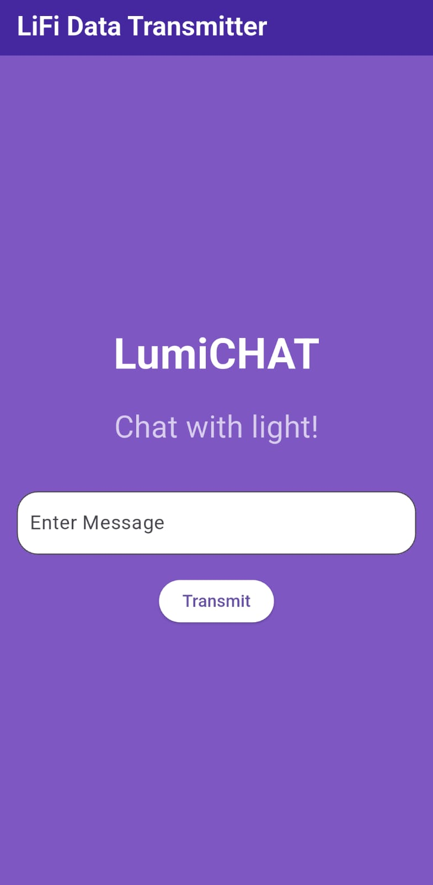

# lumichat💡

**Light can do what!!!**

Wanna see how you can send and recieve messages with **LIGHT**?? Check this out!

## Getting Started

A few resources to get you started if this is your first Flutter project:

- [Lab: Write your first Flutter app](https://docs.flutter.dev/get-started/codelab)
- [Cookbook: Useful Flutter samples](https://docs.flutter.dev/cookbook)

For help getting started with Flutter development, view the
[online documentation](https://docs.flutter.dev/), which offers tutorials,
samples, guidance on mobile development, and a full API reference.

## Flutter Frontend

#### Prerequisites

- Flutter SDK installed
- Dart installed

### Setup

**Step 1:** Navigate to project directory and get dependencies

```bash
cd lumichat
flutter pub get
```
**Step 2:** Run the app on your **PHONE**

You can't be using an emulator haha. You'll need to have Developer mode enabled. Once you do that, you could enable USB debugging in developer mode settings. 

Then follow these steps: 

- connect your phone physically to your PC
- select your device on the IDE
- click run

Alternately, you could build the application, but we don't really need to do that. Besides, this is way easier.

## Reciever Circuitry⚡️

### Credits

The circuit diagram (`Circuit diagram.png`) used in this project is from [Li-Fi Project using Arduino](https://github.com/himanshus2847/Li-Fi-Project-using-Arduino) by [@himanshus2847](https://github.com/himanshus2847). For more clarity, you could check out their YouTube video. Link is on their GitHub.

**❗️IMPORTANT❗️**

Make sure that you use analog input pins of the arduino; preferably, the A0 pin. The circuit diagram as well as the YouTube video tutorial uses digital input pin. 

**What you need:**

- Arduino Uno
- 16x2 LCD display
- ⁠LDR Sensor module
- ⁠half breadboard
- 1k ohm resistor
- ⁠M-M Jumper wires

Once the circuit is ready, go ahead and use Arduino IDE to upload the reciever logic into the Arduino board. The reciever code is given inside 'arduino code' directory. 

**Additional Considerations**

Consider keeping the circuit inside a closed box so that the sensor is not exposed to external light sources for best results. Make sure to put a hole so that you can let the flashlight hit the sensor. 

That's it!!

## Final Words

Pull requests are welcome! If you’d like to improve the app or add new features, please fork the repository and create a new branch for your changes.

For questions, suggestions, or collaborations, feel free to reach out via GitHub issues or connect directly.

---

## Screenshots

 


